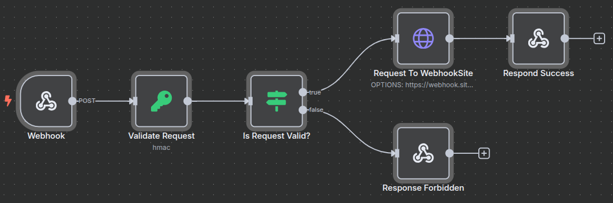

# n8n Workflow: Scalev Webhook Integration

This repository contains a simple n8n workflow template (`.json`) that demonstrates how to receive and process incoming webhooks from **Scalev**. This serves as a basic starting point for building more complex automations.

---

## 🚀 What is n8n?

**n8n** (pronounced "n-eight-n") is a powerful, source-available workflow automation tool. It enables you to connect various applications and services to automate tasks using a visual, node-based editor. It's like a free and self-hostable alternative to Zapier or Make.

This tool is perfect for developers who want to quickly integrate different APIs and services without writing boilerplate code, while still having the flexibility to add custom logic when needed.

For more details, check out the official **[n8n documentation](https://docs.n8n.io/)**.

---

## 🛠️ How to Use This Workflow

Follow these simple steps to get the workflow up and running in your n8n instance.

### 1. Download the Workflow File
Download the `workflow.json` file from this repository to your local machine.

### 2. Import into n8n
1.  Open your n8n canvas.
2.  Click on the **Import** button in the top menu.
3.  Select **Import from File**.
4.  Choose the `workflow.json` file you just downloaded.
5.  The workflow will now appear on your canvas. ✨

---

## 🖼️ The Workflow

After importing, your workflow should look like this:

---

## ⚙️ Workflow Explained

This workflow consists of two main nodes that work together to capture and process data.

### 1. Webhook Node (Trigger)
* **Purpose:** This is the entry point of the automation. It generates a unique URL to listen for incoming HTTP requests.
* **How it works:**
    * Once you activate the workflow, this node will provide a **Test URL** and a **Production URL**.
    * Please save the Production URL as your webhook URL in your Scalev Account.
    * When Scalev sends an event, this node will trigger the workflow and pass the received JSON data to the next node.

### 2. Validate Request
* **Purpose:** Verify the authenticity of incoming webhook requests from Scalev by validating the X-Scalev-Hmac-Sha256 header.
* **How it works**:
    * The X-Scalev-Hmac-Sha256 header contains a signature generated by Scalev.
    * To validate the header, please refer to the documentation: [Verifying a Webhook Request](https://developers.scalev.id/docs/verifying-a-webhook-request).

### 3. Set Node (Action)
* **Purpose:** This node is an example of how you can process the data received from the webhook.
* **How it works:**
    * **This node is meant to be customized!** You can replace it or add other nodes after it to perform actions like:
        * Calling another API.
        * Sending a message to Slack or Discord.
        * Adding a row to a Google Sheet or Airtable.
        * Storing data in a database (e.g., PostgreSQL, MySQL).